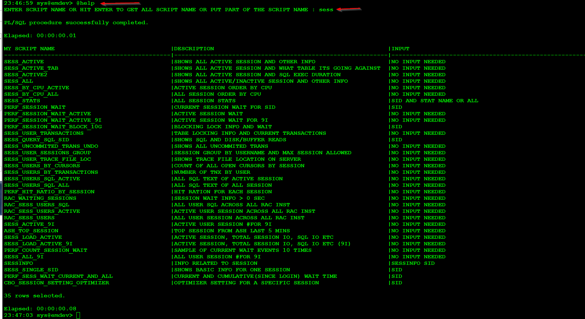
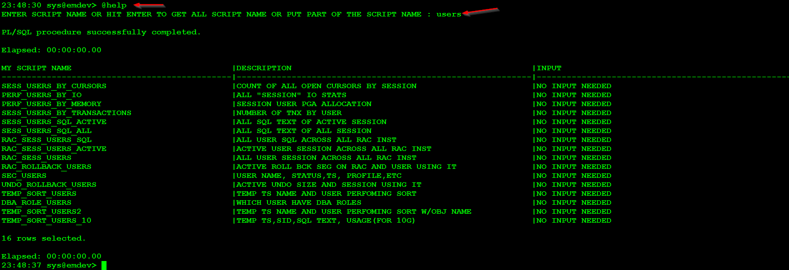
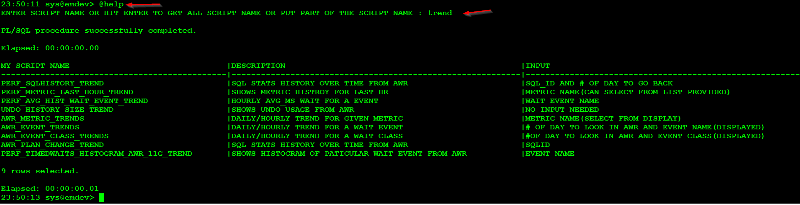
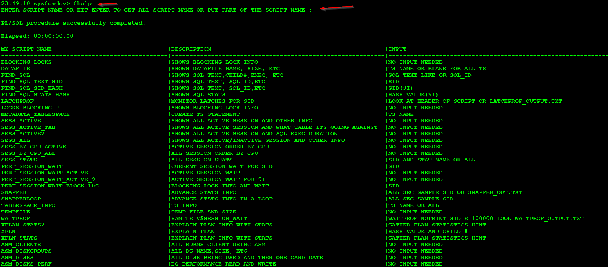

# Oracle_SQL_Scripts

SQL Scripts Related to Oracle.  Most of them work on 10g+ and some one 12c.  There are some scripts that get information from Recovery Catalog as well.

Please note some script have been taken from others who have opened sourced it (for example the more popular ones like snapper from Tanel and xplan_ash from Randolf) and some are my own.  This is just a curated list that I have put together that I use from day to day.

Due to the sheer number of scripts, it was hard for me to remember name of every single script to I created another script(help.sql) to keep track of all the other script.

Once logged into a database(10g+), you can run @help.sql as shown below.  Here I am looking for anything(like statement) that has "sess" in the script name.

Quick description of what each column mean above.
MY SCRIPT NAME = obviously the script name itself
DESCRIPTION = short description of what the script is suppose to do
INPUT = any input required when running the script.  In the above screen shot, if we were to run "perf_session_wait", we would need to pass in the session ID(SID)

Next example shows running help file and searching for anything that has "users" in the script name.

Next example shows running help file and searching for anything that has "trend" in the script name.

Next example shows running help file but we hit enter(no input) and that will spit out all the script names (300+)

Please note that the help.sql file is not being updated automatically, if we were to add a new script to this repo we will have to manually go in and update the help.sql file to put in the script name, description and if any input is required or not.